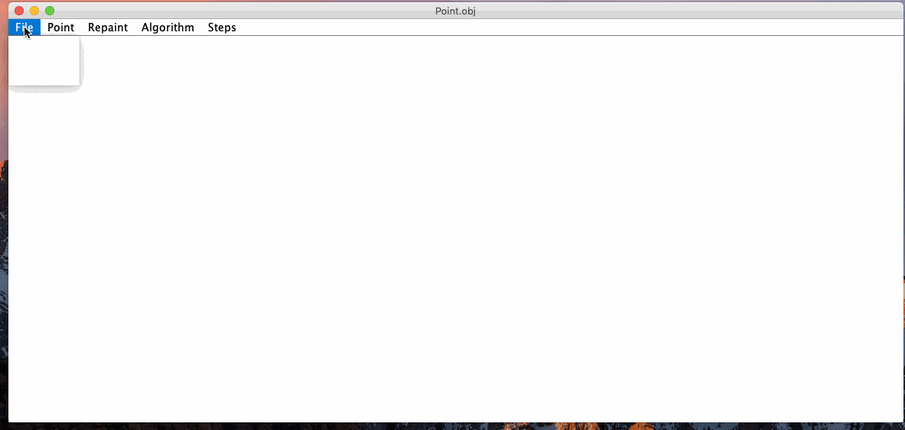

> B 样条画曲线




> 参考内容

* <http://www.html-js.com/article/1628>


> 核心代码

```java
/**
 * B 样条曲线
 * @param points
 * @param n
 * @param steps
 * @param g
 */
public static void drawB_Spline3(int points[][],int n,int steps,Graphics g){

    if (n+3 >= points.length ){
        n = points.length-4;
    }
    int  x,y,x0,y0;
    double a0,a1,a2,a3,dt,t,t2,t3;
    dt = 1.0/steps;
    a0 = 1/6.0;
    a1 = 2.0/3.0;
    a2 = 1/6.0;
    a3 = 0.0;
    x = (int)(a0 * points[n][0] + a1 * points[n+1][0] + a2 * points[n+2][0] + a3 * points[n+3][0]);
    y = (int)(a0 * points[n][1] + a1 * points[n+1][1] + a2 * points[n+2][1] + a3 * points[n+3][1]);

    for (int i = 0; i < steps; i++) {
        t = i*dt;
        t2 = t*t;
        t3 = t*t2;
        a0 = (-t3/6.0 + t2/2.0 - t/2.0 + 1/6.0);
        a1 = (t3/2.0 - t2 + 2.0/3.0);
        a2 = (-t3/2.0 + t2/2.0 + t/2.0 + 1/6.0);
        a3 = t3/6.0;
        x0 = x;
        y0 = y;
        x = (int)(a0 * points[n][0] + a1 * points[n+1][0] + a2 * points[n+2][0] + a3 * points[n+3][0]);
        y = (int)(a0 * points[n][1] + a1 * points[n+1][1] + a2 * points[n+2][1] + a3 * points[n+3][1]);
        drawLineByBresenham(x0,y0,x,y,g);
    }

}
```


```java
/**
 * 画数组中的点
 * @param points
 * @param g
 * @param power
 */
public static void drawPoints(int points[][],Graphics g,int power,int count,Color color){
    g.setColor(color);
    for (int i = 0; i < count; i++) {
        g.fillRect(points[i][0],points[i][1],power,power);

    }
}
```


如果想看矩阵等详细代码 请查看本工程底下的   `ComputerGraphics\src\GraphicsUtil\origin` 文件