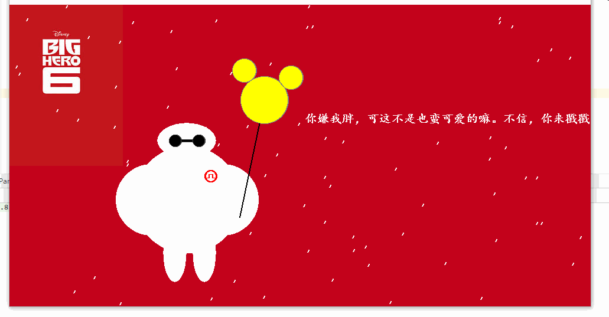

> 可爱的大白





> 画直线

1. DDA直线生成算法

```java
public static  void drawLineByDDA(int x1, int y1, int x2, int y2, Graphics g) {

    int length = 0;
    double dy = 0;
    double dx = 0;
    double x = x1;
    double y = y1;
    int k = 0;
    length = Math.max(Math.abs(x2 - x1), Math.abs(y2 - y1));
    dx = (double) (x2 - x1) / length;
    dy = (double) (y2 - y1) / length;
    while (k < length) {
        drawPoint((int) x, (int) y, g);
        x = x + dx;
        y = y + dy;
        k++;
    }

}
```

2. 中点画线法

```java
public static void drawLineByMidPoint(int x1, int y1, int x2, int y2, Graphics g) {
    int x, y, a, b, d, d1, d2;
    a = y1 - y2;
    b = x2 - x1;
    x = x1;
    y = y1;
    d = 2 * a + b;
    d1 = 2 * a;
    d2 = 2 * (a + b);

    drawPoint(x, y, g);

    for (x = x1; x <= x2; x++) {

        if (d < 0) {
            y++;
            d += d2;
        } else {
            d += d1;
        }

        drawPoint(x, y, g);
    }
}
```

3. Bresenham直线生成法

```java
public static void drawLineByBresenham(int x1, int y1, int x2, int y2, Graphics g) {

    //得出差值
    int dx = Math.abs(x2 - x1);
    int dy = Math.abs(y2 - y1);

    //判断大小
    int sx = x1 < x2 ? 1 : -1;
    int sy = y1 < y2 ? 1 : -1;


    int err = (dx > dy ? dx : -dy) / 2;
    int e2 = 0;

    for (; ; ) {
        drawPoint(x1, y1, g);
        if (x1 == x2 && y1 == y2) break;
        e2 = err;
        if (e2 > -dx) {
            err -= dy;
            x1 += sx;
        }
        if (e2 < dy) {
            err += dx;
            y1 += sy;
        }
    }

}
```